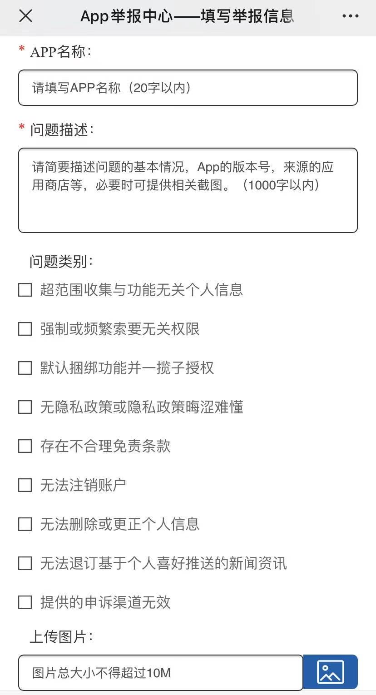

# Clean Apps

互联网公司**强行索取**或者**偷偷收集**用户隐私的行为越来越猖獗，手机 App 是收集用户隐私的最常见的途径之一。

某些公司的**隐私协议**写得如同裹脚布一般又臭又长，**甚至不同意就退出**，用户**事实上是被迫「同意」**。有时候并不是大家不在乎，而是大家没有选择。

建立 Clean Apps (https://github.com/0xHJK/CleanApps) 项目的初衷是**列出尊重用户隐私的 App** 和**曝光过度收集隐私的 App**，起到社区监督的作用，也帮助用户用脚投票，方便选择同类替代品。分析互联网公司可能会如何利用你的隐私，对后果有个直观的理解。

**让互联网为用户服务，而不是把用户变成互联网的产品。**

Clean Apps 既有「干净的应用程序」的含义，也有「清除某些应用程序」的含义，Apps 读作`/ˈæps/`。

## 介绍

由于 App 数量众多，本项目主要记录用户量比较大（百万以上）或较常见的、涉及用户隐私的、公司主体或主要运营在境内的 App。

App的分类主要参照[《常见类型移动互联网应用程序必要个人信息范围规定》](http://www.cac.gov.cn/2021-03/22/c_1617990997054277.htm)，也可参考应用商店中的分类，对于功能复杂的超级 App 按其核心功能分类。

列表中的内容主要包括：

- 公司名称
- App 名称
- App 版本
- 主要问题描述（黑榜）/推荐理由（红榜）
- 记录日期

## [iOS 黑榜](./ios.black.md)

## [Android 黑榜](./android.black.md)

##  [iOS 红榜](./ios.white.md)

## [Android 红榜](./android.white.md)

## Q&A

**1. 这样有用吗？**

不试试怎么知道呢

**2. 如何参与项目？**

按照格式要求提交 pull request 即可，需要大家一起维护才更有力量。

**3. 除了在项目中公示，还会有什么措施吗？**

如果属于违法违规行为，鼓励大家向网信办和工信部等有关部门举报。

## 法律法规

* [中华人民共和国网络安全法-中共中央网络安全和信息化委员会办公室 (cac.gov.cn)](http://www.cac.gov.cn/2016-11/07/c_1119867116.htm)
* [中华人民共和国数据安全法_中国人大网 (npc.gov.cn)](http://www.npc.gov.cn/npc/c30834/202106/7c9af12f51334a73b56d7938f99a788a.shtml)
* [中华人民共和国个人信息保护法（草案）](http://www.npc.gov.cn/flcaw/flca/ff80808175265dd401754405c03f154c/attachment.pdf)
* [个人信息保护法草案将三审：规范APP过度收集个人信息_中国人大网 (npc.gov.cn)](http://www.npc.gov.cn/npc/kgfb/202108/a8468fe8e36245aa93abb8425915aacc.shtml)
* [关于印发《App违法违规收集使用个人信息行为认定方法》的通知-中共中央网络安全和信息化委员会办公室 (cac.gov.cn)](http://www.cac.gov.cn/2019-12/27/c_1578986455686625.htm)
* [关于印发《常见类型移动互联网应用程序必要个人信息范围规定》的通知-中共中央网络安全和信息化委员会办公室 (cac.gov.cn)](http://www.cac.gov.cn/2021-03/22/c_1617990997054277.htm)
* [电信和互联网用户个人信息保护规定-中共中央网络安全和信息化委员会办公室 (cac.gov.cn)](http://www.cac.gov.cn/2012-07/29/c_133142088.htm)

## 举报方式

凡涉及App违法违规收集使用个人信息（如超范围收集个人信息、强制捆绑其他功能、过度索要系统权限、隐私政策不合理等）均在举报受理范围。

* 发送邮件至`pipo@cybersac.cn`，说明情况和截图
* 关注「App个人信息举报」公众号进行举报（推荐）
* [12321网络不良与垃圾信息举报受理中心](https://www.12321.cn/)

## 致谢

感谢所有转发、提建议和参与维护的朋友。

